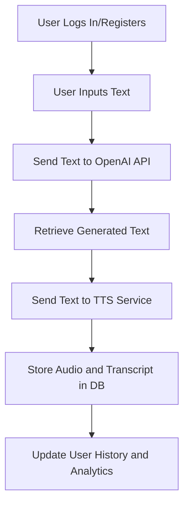
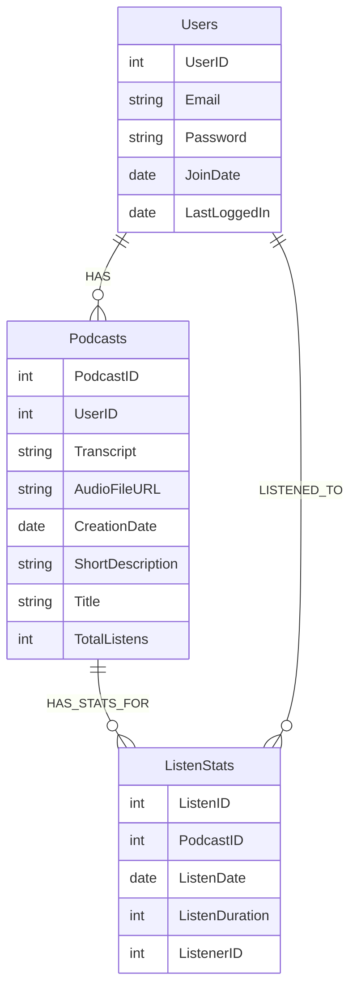

# Echo

# Data Update Flow for AI Podcast Creation Service

## Overview

When a user wants to create a new podcast, the system will follow these steps:

1. User authentication
2. Text input by the user.
3. Text processing through OpenAI API.
4. Audio generation via a TTS service.
5. Storing podcast data in the database.
6. Updating user history and analytics.

Here's a visual representation of the process:

1. Managing State with JWT and Auth: To secure your application and manage the
   state of the user, you'll need an authentication process on both the client
   and server sides:

Client-Side: JWT Storage: Use either cookies (marked as HTTPOnly and Secure) or
opt for localStorage/sessionStorage. Cookies provide a safer shield against XSS
attacks, but it comes at the cost of making it less accessible for client-side
scripting.

State Management: Frameworks like React, Vue, or Angular come with state
management libraries (e.g., Redux, Vuex) to consistently track user state
throughout the application's lifecycle.

Server-Side with Fresh/Deno: JWT Validation: Every API request should come with
JWT validation. The general flow includes: User logs in through your API. The
backend verifies user credentials with Supabase and fetches a JWT. The JWT is
then sent back to the client. For every subsequent API request, the client must
send the JWT within the request headers. Your server will validate this JWT,
either by confirming its signature or liaising with Supabase for verification.
2. ERD Database Diagram: To support your AI podcast creation service, the
database should comprise several tables. Here's a recommended schema:

Users Table: UserID (Primary Key) Email Password (hashed) Join Date Podcasts
Table: PodcastID (Primary Key) UserID (Foreign Key) Transcript AudioFileURL
CreationDate ShortDescription Title (could be auto-generated or entered by the
user) ListenStats Table: ListenID (Primary Key) PodcastID (Foreign Key)
ListenerID (Foreign Key referring to Users; could be null for non-users)
ListenDate ListenDuration (denoting the duration of listening) You might also
expand this schema with additional tables dedicated to categories/tags,
likes/favorites, sharing statistics, and so forth, based on the features you
envision.

3. Workflow: The podcast generation journey typically follows this route:

User signs up or logs in. User provides a brief sentence or offers directives.
Backend receives this input and forwards it to the OpenAI API. The text
generated from OpenAI API is obtained. This text is then sent over to a TTS
(Text-to-Speech) service. The resulting audio file URL, along with its
transcript, is stored in the "Podcasts" table. Whenever a podcast is listened
to, by either a user or an anonymous entity, the "ListenStats" table's counter
gets an increment.

4. Gathering and Analyzing Data: To deduce insights and appraise metrics:

SQL with Supabase: Leverage SQL queries in tandem with Supabase to garner
insights on popular podcasts, the degree of user engagement, daily listenership,
and more.

Analytics Integration: Integrate third-party analytics tools, such as Google
Analytics, to procure comprehensive data on user interactions within your
platform.

## Project File Structure

- `echo/`
  - `static/`
    - `index.html`
    - `style.css` (optional)
  - `routes/`
    - `index.tsx` (Homepage)
    - `_app.tsx` (Global layout)
    - `_404.tsx` (404 error page)
    - `auth.ts` (Authentication related routes)
    - `api/`
      - `chat.tsx` (OpenAI Route)
      - `audio.tsx` (ElevenLabs Route)
      - `fetchStoredUrl.tsx`
      - `login.tsx
    - `history.ts` (Routes for fetching user's interaction history)
    - `_404.tsx`
    - `_app.tsx`
    - `auth.ts`
    - `index.tsx`
  - `islands/`
    - `UnifiedIsland.ts`
      - `TextField.ts`
      - `TextToSpeech.ts`
      - `AudioPlayer.ts`
      - `History.ts`
      - `UnifiedIsland.tsx`
  - `handlers/`
  - `db/`
  - `dev.ts` (Development server initialization)
  - `main.ts` (Production entry point)
  - `deno.json` (Dependencies and tasks configurations)
